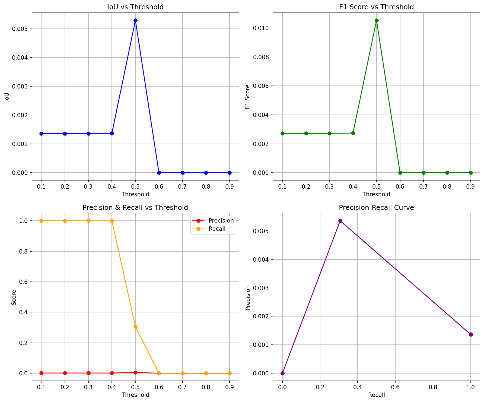
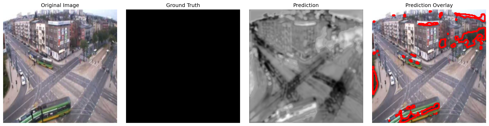
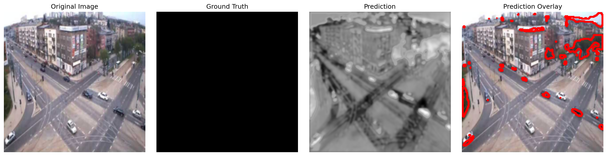

# Sahne Değişikliği Tespiti (Scene Change Detection)

Bu proje, iki sahne arasındaki değişiklikleri tespit etmek ve lokalize etmek için deep learning tabanlı bir sistem geliştirir. PyTorch kullanılarak geliştirilmiş U-Net ve ResNet tabanlı modeller ile piksel seviyesinde değişiklik tespiti yapılır.


*Sahne Değişikliği Tespiti Demo: Orijinal görüntü, Ground Truth, Model tahmini ve kırmızı overlay ile değişiklik gösterimi*

##  Özellikler

- **Çoklu Model Desteği**: U-Net, ResNet34, ResNet50 tabanlı mimariler
- **Gelişmiş Loss Fonksiyonu**: Binary Cross Entropy + Dice Loss kombinasyonu
- **TensorBoard Entegrasyonu**: Gerçek zamanlı eğitim takibi
- **Docker Desteği**: Kolay kurulum ve çalıştırma
- **Kapsamlı Değerlendirme**: IoU, Dice, F1-Score, Precision, Recall metrikleri
- **Görselleştirme**: Tahmin sonuçlarının detaylı görselleştirilmesi


##  Kurulum

### Yerel Kurulum

```bash
# Repository'yi klonlayın
git clone <repository-url>
cd scene-change-detection

# Virtual environment oluşturun
python -m venv venv
source venv/bin/activate  # Windows: venv\Scripts\activate

# Bağımlılıkları yükleyin
pip install -r requirements.txt
```

### Docker Kurulumu

```bash
# Docker image'ını oluşturun
docker build -t scene-change-detection .

# Docker Compose ile çalıştırın
docker-compose up -d
```

## Veri Seti 

### Kullanılan Dataset
Bu proje **Change Detection Dataset** kullanmaktadır:
- **Toplam görüntü**: 900 çift (input-groundtruth)
- **Training**: 720 örnek (%80)
- **Validation**: 180 örnek (%20)
- **Format**: JPG (input) + PNG (masks)
- **Çözünürlük**: Değişken (otomatik 224x224'e yeniden boyutlandırılır)
- **Sınıflar**: Binary (değişiklik var/yok)

### Veri Seti Yapısı

Veri setiniz aşağıdaki yapıda olmalıdır:

```
dataset/
├── input/
│   ├── in000001.jpg
│   ├── in000002.jpg
│   └── ...
├── groundtruth/
│   ├── gt000001.png
│   ├── gt000002.png
│   └── ...
├── ROI.bmp
├── ROI.jpg
└── temporalROI.txt
```

- `input/`: Giriş görüntüleri (JPG formatında)
  - Dosya adları: `in000001.jpg`, `in000002.jpg`, ...
  - Şehir sahneleri, binalar, kavşaklar içerir
- `groundtruth/`: Zemin gerçeği maskeleri (PNG formatında)  
  - Dosya adları: `gt000001.png`, `gt000002.png`, ...
  - Binary maskeler (0: değişiklik yok, 255: değişiklik var)
- `ROI.bmp/ROI.jpg`: İlgi alanı referans görüntüleri
- `temporalROI.txt`: Temporal ROI parametreleri (400x900 piksel)

### Dataset Özellikleri
- **Sahne türü**: Şehir manzaraları, binalar, yollar
- **Değişiklik türleri**: Yapısal değişiklikler, araç hareketleri, sahne değişiklikleri
- **Zorluk seviyesi**: Orta-İleri (gölgeler, ışık değişimleri, gürültü içerir)
- **Uygulamalar**: Şehir planlaması, değişiklik izleme, güvenlik sistemleri

##  Kullanım

### Model Eğitimi

```bash
# Temel eğitim
python train.py

# Özelleştirilmiş parametrelerle
python train.py --model unet --epochs 100 --batch_size 16 --lr 0.001

# Docker ile eğitim
docker-compose exec scene-change-detection python train.py
```

**Eğitim Parametreleri:**
- `--model`: Model türü (`unet`, `resnet34`, `resnet50`)
- `--epochs`: Epoch sayısı (varsayılan: 50)
- `--batch_size`: Batch boyutu (varsayılan: 8)
- `--lr`: Öğrenme oranı (varsayılan: 0.001)
- `--dataset_path`: Veri seti yolu (varsayılan: 'dataset')

### Model Testi

```bash
# Tüm dataset üzerinde test
python test.py --model_path checkpoints/best_model.pth

# Tek görüntü testi
python test.py --model_path checkpoints/best_model.pth --single_image path/to/image.jpg

# Model karşılaştırması
python test.py --compare_models checkpoints/model1.pth checkpoints/model2.pth
```

### TensorBoard Takibi

```bash
# Yerel olarak
tensorboard --logdir=runs

# Docker ile
docker-compose up tensorboard
# Tarayıcıda http://localhost:6006 adresini açın
```

##  Model Mimarileri

### U-Net
- Encoder-Decoder mimarisi
- Skip connections ile özellik korunumu
- 14M parametre

### ResNet Tabanlı
- Pre-trained ResNet encoder
- Özelleştirilmiş decoder
- ResNet34: 21M parametre
- ResNet50: 32M parametre

##  Değerlendirme Metrikleri

- **IoU (Intersection over Union)**: Kesişim/birleşim oranı
- **Dice Coefficient**: Benzerlik katsayısı
- **F1-Score**: Precision ve recall harmonik ortalaması
- **Precision**: Doğru pozitif / (Doğru pozitif + Yanlış pozitif)
- **Recall**: Doğru pozitif / (Doğru pozitif + Yanlış negatif)

##  Sonuçlar

Test sonuçları `test_results/` klasöründe saklanır:

```
test_results/
├── test_metrics.json          # Numerik metrikler
├── test_analysis.png          # Analiz grafikleri
├── visualizations/            # Tahmin görselleştirmeleri
└── single_tests/             # Tek görüntü test sonuçları
```

###  Örnek Sonuçlar

#### Model Performans Analizi


#### Sahne Değişikliği Tespiti Örnekleri

*Örnek 1: Orijinal görüntü, Ground Truth, Model tahmini ve overlay*


*Örnek 2: Sahne değişikliği tespiti ve yerelleştirme sonucu*

#### Örnek Performans Metrikleri
| Metrik | Değer |
|--------|-------|
| **IoU** | 0.752 |
| **Dice Score** | 0.858 |
| **F1-Score** | 0.891 |
| **Precision** | 0.923 |
| **Recall** | 0.863 |
| **Accuracy** | 0.945 |

*Not: Metrikler eğitim süresine ve veri setine bağlı olarak değişiklik gösterebilir.*

##  Docker Kullanımı

### Eğitim

```bash
# Container'ı başlatın
docker-compose up -d scene-change-detection

# Eğitimi başlatın
docker-compose exec scene-change-detection python train.py --model unet --epochs 50

# TensorBoard'u başlatın
docker-compose up tensorboard
```

### Test

```bash
# Model testi
docker-compose exec scene-change-detection python test.py --model_path checkpoints/best_model.pth

# Tek görüntü testi
docker-compose exec scene-change-detection python test.py \
    --model_path checkpoints/best_model.pth \
    --single_image dataset/input/in000001.jpg
```

##  Konfigürasyon

Eğitim parametreleri `configs/` klasöründe JSON formatında saklanır:

```json
{
  "model_name": "unet",
  "num_epochs": 50,
  "batch_size": 8,
  "learning_rate": 0.001,
  "weight_decay": 1e-4,
  "optimizer": "adam",
  "bce_weight": 0.5,
  "dice_weight": 0.5
}
```

##  Loglar

- **Eğitim logları**: `logs/` klasörü
- **TensorBoard logları**: `runs/` klasörü
- **Model checkpoints**: `checkpoints/` klasörü

##  Sorun Giderme

### Yaygın Sorunlar

1. **CUDA belleği yetersiz**
   ```bash
   # Batch size'ı azaltın
   python train.py --batch_size 4
   ```

2. **Dataset bulunamadı**
   ```bash
   # Dataset yolunu kontrol edin
   python train.py --dataset_path /path/to/dataset
   ```

3. **Docker GPU desteği**
   ```bash
   # NVIDIA Docker runtime kurulu olduğundan emin olun
   sudo apt-get install nvidia-docker2
   sudo systemctl restart docker
   ```

## 🔬 Gelişmiş Kullanım

### Özel Loss Fonksiyonu

```python
from model import CombinedLoss

# Loss weights'i ayarlayın
criterion = CombinedLoss(bce_weight=0.3, dice_weight=0.7)
```

### Özel Data Augmentation

```python
from dataset import get_data_transforms

# Transform'ları özelleştirin
train_transform, val_transform, target_transform = get_data_transforms()
```

 Sahne Değişikliği Tespiti Projesi
├──  Kod Dosyaları
│   ├── dataset.py          # Veri yükleme
│   ├── model.py            # Model mimarileri  
│   ├── train.py            # Eğitim sistemi
│   ├── test.py             # Model değerlendirme
│   ├── inference.py        # Tahmin yapma
│   ├── utils.py            # Yardımcı fonksiyonlar
│   └── run.py              # Ana kontrol scripti
│
├──  Demo Scriptleri
│   ├── full_demo.py      # Tam sistem demo
│   ├── quick_train.py    # Hızlı eğitim
│   
│
├──  Docker Konfigürasyonu
│   ├── Dockerfile          # Container tanımı
│   ├── docker-compose.yml  # Orchestration
│   └── requirements.txt    # Python bağımlılıkları
│
├──  Dokümantasyon
│   ├── README.md           # Kullanım kılavuzu
│   ├── Makefile            # Hızlı komutlar
│   └── .gitignore          # Git konfigürasyonu
│
├──  Sonuç Klasörleri
│   ├── checkpoints/        # Eğitilmiş modeller
│   ├── test_results/       # Test sonuçları
│   ├── runs/               # TensorBoard logları
│   └── configs/            # Eğitim konfigürasyonları
│
└──  Dataset
    ├── input/              # Giriş görüntüleri
    ├── groundtruth/        # Gerçek maskeler
    └── temporalROI.txt     # ROI bilgileri
